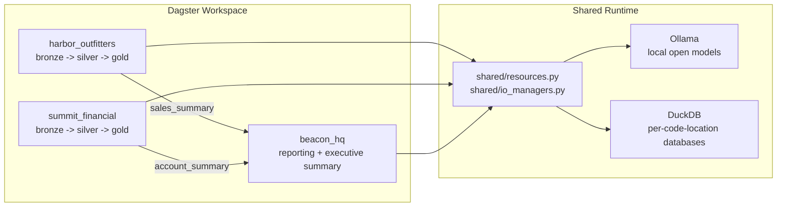

# Dagster Multi-Tenant Example

This repository is a runnable Dagster demo that shows how to:

- split one project into multiple Dagster code locations
- keep tenant pipelines isolated while coordinating them from Dagster
- treat LLM work as data engineering and context engineering, not just prompt calls
- run different model/runtime combinations per code location
- use a single local Ollama service for end-to-end development

The example uses three business-facing code locations:

- `harbor_outfitters`: retail catalog enrichment
- `summit_financial`: transaction risk scoring
- `beacon_hq`: executive reporting built from upstream business outputs

## Architecture



## What The Demo Shows

- `harbor_outfitters` builds catalog context from product, brand, and taxonomy data before generating enriched product copy.
- `summit_financial` builds investigation context from transactions, accounts, and rules before generating transaction rationales.
- `beacon_hq` depends on upstream business outputs and turns them into a short executive briefing.

The local setup is intentionally opinionated:

- one Ollama container
- one root development environment
- one copied Python environment per code location
- one shared lock for local LLM requests so the demo stays stable on smaller laptops

## Repository Layout

```text
harbor_outfitters/     Retail assets, jobs, and schedules
summit_financial/      Financial assets, jobs, and schedules
beacon_hq/             Reporting assets, jobs, and sensors
shared/                Shared LLM resource, IO manager, and metadata helpers
scripts/               Local setup scripts for models and per-location envs
vendor/                Tiny runtime marker packages installed per code location
tests/                 End-to-end unit tests with fake LLM resources
workspace.yaml         Multi-code-location Dagster workspace
dagster_cloud.yaml     Dagster+ style code location config
```

## Local Stack

Each code location points at the same Ollama instance but uses its own default model:

- `harbor_outfitters`: `qwen2.5:0.5b`
- `summit_financial`: `qwen2.5:1.5b`
- `beacon_hq`: `qwen2.5:0.5b`

Each code location also has its own runtime marker package and version:

- `harbor_outfitters`: `catalog_coach_runtime==1.4.0`
- `summit_financial`: `risk_reviewer_runtime==2.2.0`
- `beacon_hq`: `briefing_writer_runtime==0.9.0`

Assets are persisted to per-code-location DuckDB databases under `data/`.

## Quickstart

Start Ollama and pull the local models:

```bash
docker compose up -d ollama
./scripts/pull_ollama_models.sh
cp .env.example .env
set -a
source .env
set +a
```

Create the root development environment:

```bash
python -m venv .venv
source .venv/bin/activate
pip install -e ".[dev]"
```

Create one copied environment per code location:

```bash
./scripts/setup_code_location_envs.sh
```

Start Dagster locally:

```bash
source .venv/bin/activate
set -a
source .env
set +a
export DAGSTER_HOME=$(pwd)/.dagster_home
mkdir -p "$DAGSTER_HOME"
dg dev -w workspace.yaml
```

Then open `http://127.0.0.1:3000`.

## Validation

Run the local checks with:

```bash
source .venv/bin/activate
set -a
source .env
set +a
export DAGSTER_HOME=$(pwd)/.dagster_home
mkdir -p "$DAGSTER_HOME"
ruff check .
pytest -q -o cache_dir=/tmp/pytest-cache
dg check defs
```

## Demo Flow

If you want the shortest end-to-end local proof, materialize the LLM-backed terminal assets one at a time:

```bash
DAGSTER_HOME=$(pwd)/.dagster_home .code_locations/harbor_outfitters/.venv/bin/dg launch --assets '+key:harbor_outfitters/enriched_products' -m harbor_outfitters -d $(pwd)
DAGSTER_HOME=$(pwd)/.dagster_home .code_locations/summit_financial/.venv/bin/dg launch --assets '+key:summit_financial/transaction_risk_scores' -m summit_financial -d $(pwd)
DAGSTER_HOME=$(pwd)/.dagster_home .code_locations/beacon_hq/.venv/bin/dg launch --assets '+key:beacon_hq/executive_summary' -m beacon_hq -d $(pwd)
```

Running those sequentially matters. The repo uses one local Ollama instance, so local LLM-heavy runs should not be launched in parallel unless you increase machine capacity.

## Jobs And Automation

The repo includes pipeline-shaped jobs for each business unit:

- `harbor_catalog_publish_job`
- `summit_risk_scoring_job`
- `beacon_executive_briefing_job`

It also includes simple cross-location orchestration:

- `harbor_daily_refresh_schedule`
- `summit_daily_refresh_schedule`
- `beacon_after_upstream_success_sensor`

The key point is that lineage crosses code locations, but execution stays per code location. Beacon reacts to Harbor and Summit outputs instead of collapsing everything into one monolithic job.

## Notes

- Runtime DataFrame metadata includes `row_count` and `top_5_rows` on asset materializations.
- Tests use fake LLM resources from `tests/fakes.py`; production code talks to Ollama directly.
- The current defaults are intentionally small so the project works on a typical laptop Docker setup.
